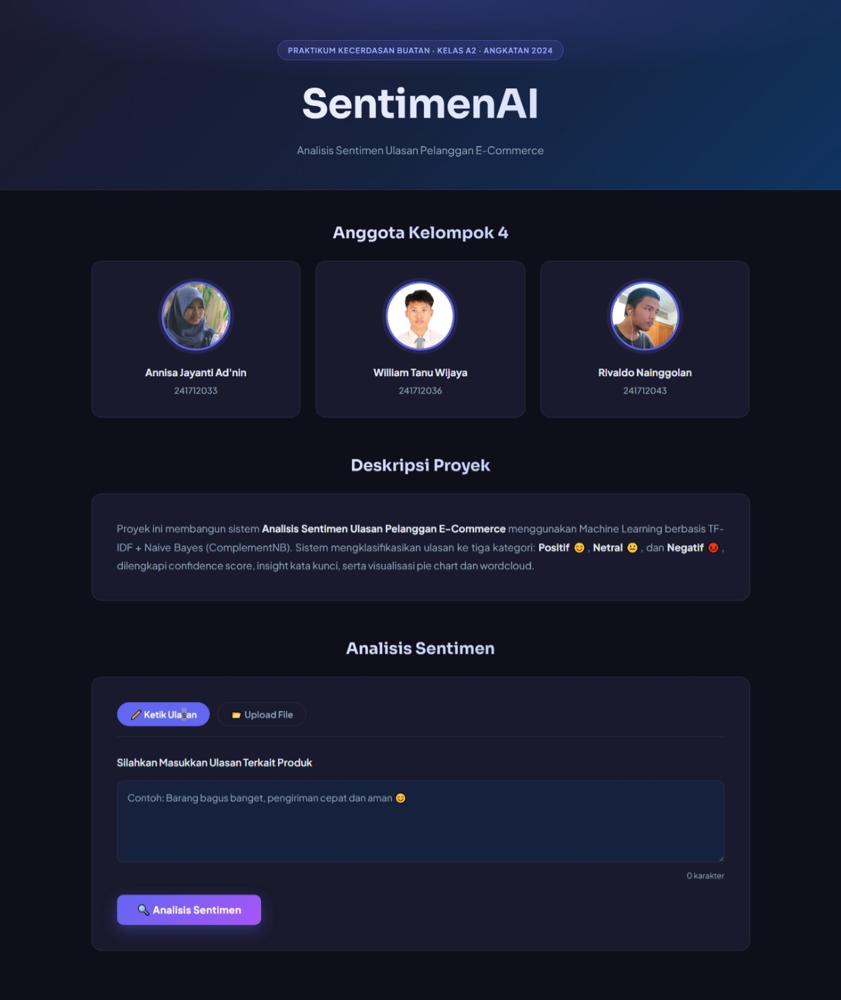

# SentimenAI — Analisis Sentimen Ulasan E-Commerce

SentimenAI adalah aplikasi web berbasis Machine Learning untuk menganalisis sentimen ulasan pelanggan e-commerce menggunakan metode **TF-IDF + Complement Naive Bayes (ComplementNB)**.

Sistem dapat mengklasifikasikan ulasan menjadi:

- 😊 Positif
- 😐 Netral
- 😡 Negatif

Selain itu, aplikasi juga menampilkan:

- Confidence score
- Visualisasi pie chart
- Wordcloud kata yang sering muncul
- Analisis file Excel / CSV
- Tabel hasil analisis dengan pagination

---

# Preview Website

## Full Page Website



---

# Features

- Analisis sentimen teks secara real-time
- Upload file `.csv`, `.xls`, `.xlsx`
- Visualisasi statistik sentimen
- Wordcloud kata positif & negatif
- Modern dark UI design
- Drag & drop upload
- Loading animation
- Pagination hasil analisis
- Auto install dependencies

---

# Technologies Used

- Python
- Flask
- Scikit-learn
- Pandas
- NumPy
- Chart.js
- HTML
- CSS
- JavaScript

---

# Machine Learning Model

Model yang digunakan:

- TF-IDF Vectorizer
- Complement Naive Bayes (ComplementNB)

Dataset ulasan diproses menggunakan preprocessing sederhana:

- Lowercase
- Remove special characters
- Remove extra spaces

---

# Project Structure

```bash
SentimenAI/
│
├── app.py
├── model_tfidf.joblib
├── sentiment_model.joblib
│
├── templates/
│   └── index.html
│
├── static/
│   ├── style.css
│   └── img/
│       ├── Annisa Jannayanti adnin.jpg
│       ├── William Tanu Wijaya.jpg
│       ├── Rivaldo Nainggolan.jpg
│       └── website full page.jpeg
│
└── README.md